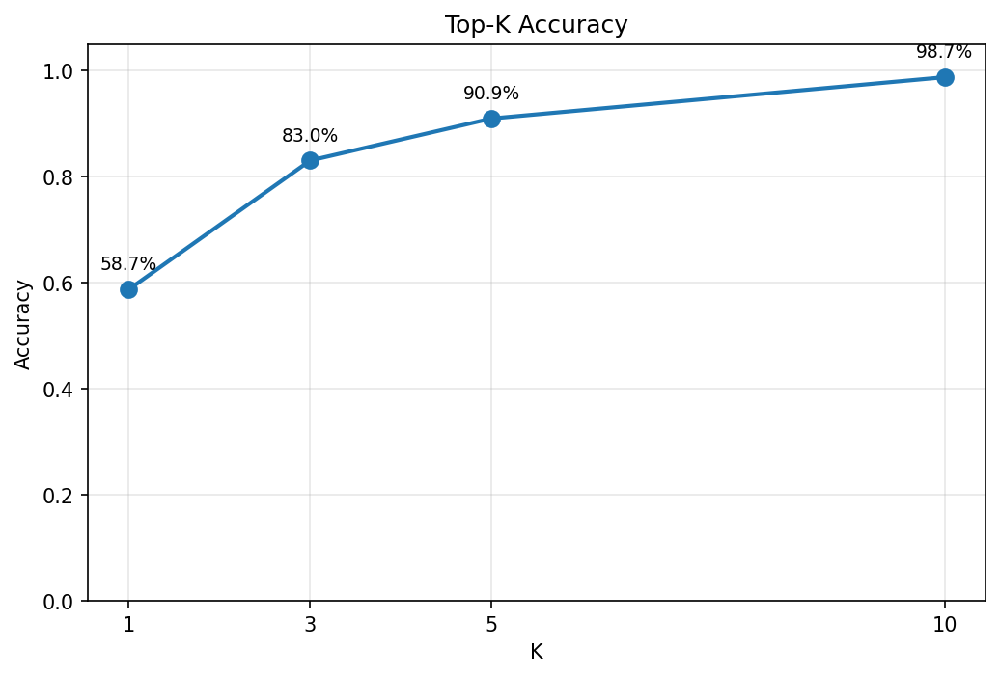
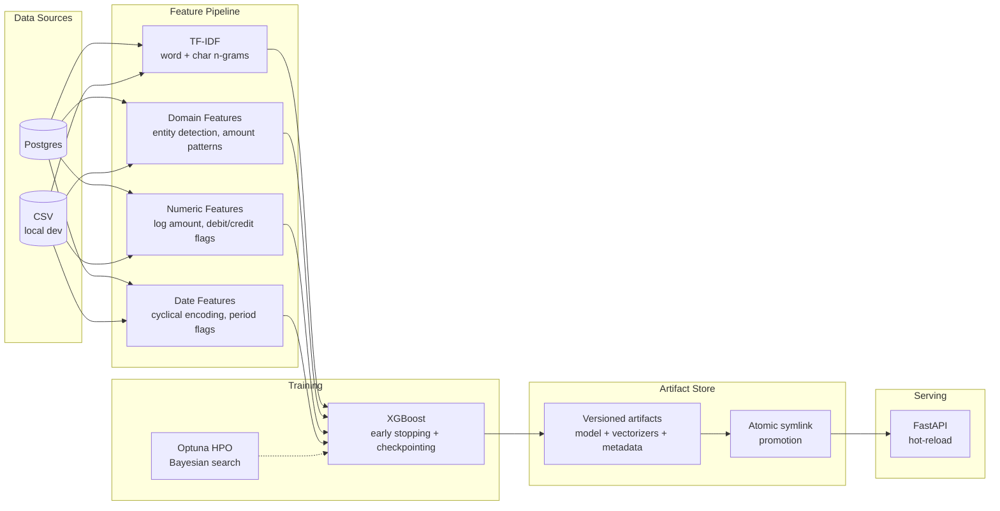

# Transaction Classifier

[](https://github.com/nlorber/transaction-classifier/actions/workflows/test.yml)


Multi-class classification system that predicts French accounting codes from financial transaction data. Returns ranked top-K account code suggestions with confidence scores, served via a FastAPI inference API.

## Key Results

Trained on **synthetic data** (7,508 transactions, 80 account classes). On real client data with higher transaction volume and consistent labeling, top-1 accuracy is substantially higher — synthetic metrics above are a lower bound. Synthetic data uses uniform entity distribution and random label templates, removing the client-specific patterns that drive accuracy in production. The feature engineering (URSSAF deadlines, TVA periods, entity detection) was designed for these real-world signals.

| Metric | Value |
|---|---|
| Top-1 accuracy | 58.7% |
| Top-3 accuracy | 83.0% |
| Top-5 accuracy | 90.9% |
| Top-10 accuracy | 98.7% |
| Balanced accuracy | 49.3% |
| Classes | 80 |
| Evaluation samples | 1,502 |

### Feature Ablation

Cumulative accuracy on the temporal validation split. Each row adds one feature family. Same XGBoost hyperparameters throughout.

| Feature set | Accuracy | Balanced Accuracy |
|---|---|---|
| TF-IDF only | 0.5546 | 0.4418 |
| + numeric | 0.5905 | 0.5045 |
| + date | 0.5792 | 0.4865 |
| + domain (all features) | 0.5839 | 0.4881 |

Date and domain features show marginal or negative lift on synthetic data because the generator produces uniformly distributed timestamps and simplified entity patterns. On real client data with seasonal patterns and consistent entity naming, these features provide meaningful signal.

### Model Comparison

Same feature matrix, same temporal split. XGBoost is the production choice; LightGBM and logistic regression are baselines.

| Model | Balanced Accuracy | F1 (weighted) | Train time |
|---|---|---|---|
| **XGBoost** | **0.4881** | **0.5528** | 30.0s |
| LightGBM | 0.4047 | 0.5145 | 26.5s |
| Logistic Regression | 0.0115 | 0.0160 | 43.4s |

XGBoost outperforms LightGBM by ~8pp on balanced accuracy with the same hyperparameter style. Logistic regression is not competitive on this task — the 80-class problem with sparse TF-IDF features and domain indicators benefits from tree-based feature interactions that linear models cannot capture. Reproduce with `uv run python scripts/compare_models.py`.



## Why This Design

- **Temporal train/val split** — no random shuffle. _In production, you predict future transactions from past patterns; random splits leak future information and inflate metrics._
- **Atomic symlink promotion** — new model artifacts land in a versioned directory; a symlink swap makes them live. _Prevents serving half-written model files during deployment._
- **Quality gate before promotion** — floor thresholds (not targets) block catastrophically bad models. _Catches cold-start scenarios where sparse training data produces a model worse than the previous version._
- **Hot-reload with in-flight completion** — filesystem events (watchdog) with debounce + old predictor stays alive until current requests finish. _Zero-downtime model updates without a load balancer or blue-green deployment._

## Architecture



## Design Decisions

**Why XGBoost over neural approaches.** The input is structured tabular data with high cardinality categorical features and class imbalance (80 classes, long-tail distribution). Gradient-boosted trees handle this natively without the sampling gymnastics or architecture tuning that neural nets require. Training completes in seconds, not hours, which matters when retraining on a schedule. Feature importance is directly interpretable for debugging misclassifications with domain experts.

**Why TF-IDF + domain features, not embeddings.** French accounting transaction text is formulaic: `URSSAF COTISATIONS`, `PRLV SEPA CPY:FR123`. Pattern-based features (entity detection, regex-extracted markers) outperform dense embeddings because the signal is in known keywords and structural patterns, not semantic meaning. TF-IDF character n-grams capture morphological variations (e.g., `COTISATION` vs `COTISATIONS`) without a pretrained language model. The feature space is sparse but highly discriminative for this domain.

**Why temporal split over random split.** Financial transactions are sequential. A random split leaks information: the model sees January and March during training, then "predicts" February during evaluation. Temporal splitting (train on earlier months, evaluate on later months) reflects real deployment conditions where the model always predicts future transactions. This gives honest metrics and catches temporal drift.

**Why single-tenant.** This system targets a single accounting entity's transaction data. The feature profile (`config/profiles/`) is the extension point for different domains or countries --- create a new profile rather than a new client.

**Why artifact versioning with atomic symlink promotion.** Model updates must be zero-downtime. Each training run produces a timestamped artifact directory (`v-20260301-120000/`) containing the model, vectorizers, label encoder, and a manifest with checksums. Promotion is an atomic `symlink` swap of the `current` pointer. The serving layer watches this symlink and hot-reloads on change. If a new model fails validation, the old symlink stays --- no broken state.

## Feature Engineering

Four feature families, concatenated into a single feature matrix per transaction:

**Text features** --- TF-IDF vectorization of transaction descriptions.
- Word n-grams (1,2) on `description` and `remarks` fields separately (3,000 + 5,000 features)
- Character n-grams (3,5) on combined text (2,000 features)
- Sublinear TF scaling, accent stripping, HTML cleaning

**Domain features** --- Config-driven indicators loaded from a YAML profile (`config/profiles/french_treasury.yaml`, selected via `TXCLS_FEATURE_PROFILE`).
- Entity detection: binary flags for known entities defined in the profile (URSSAF, DGFIP, EDF, telecom providers, banks, etc.)
- Amount patterns: magnitude buckets, round amount flag, salary/wage range detection — thresholds from the profile
- Fiscal period: quarter-end, year-end, VAT/corporate tax/URSSAF deadline indicators — dates from the profile
- Text signals and SEPA structured fields: all regex patterns defined in the profile, not hardcoded

**Numeric features** --- Engineered from transaction amounts.
- `log_amount`, `is_debit`, `is_credit`, ordinal `amount_bucket`
- Text length features: `desc_len`, `remarks_len`

**Date features** --- Temporal signals from `posting_date`.
- Raw components: `weekday`, `month_day`, `month`, `quarter`
- Binary flags: `is_month_end`, `is_month_start`, `is_weekend`
- Cyclical encoding: sin/cos transforms for day, month, day-of-week (avoids discontinuity at period boundaries)

## Quick Start

```bash
# Install all dependencies (training + serving + HPO)
uv sync --extra all

# Generate synthetic training data
uv run python scripts/generate_sample_data.py

# Train a model and promote it as current (creates models/current symlink)
uv run tc-train --auto-promote -v

# Start the prediction API (sandbox mode: no model required for local demo)
TXCLS_SANDBOX_MODE=true uv run tc-serve

# With a trained model (requires models/current symlink
# created by --auto-promote, or manually via: ln -sf models/v-YYYYMMDD-HHMMSS models/current):
# uv run tc-serve

# Predict
curl -X POST http://localhost:8000/classify \
  -H "Content-Type: application/json" \
  -d '{
    "transactions": [
      {
        "description": "URSSAF COTISATIONS",
        "remarks": "PRLV SEPA",
        "debit": 1234.56,
        "posting_date": "2025-01-15"
      }
    ],
    "top_k": 3
  }'
```

## Project Structure

```
src/transaction_classifier/
  core/                  — shared ML code used by both training and inference
    config.py            — Pydantic settings (TXCLS_ prefix)
    data/                — data providers: CSV, Postgres
    features/            — feature pipeline: text.py, engine.py, standard.py, pipeline.py
    models/              — XGBoostModel wrapper, training logic
    evaluation/          — classification report computation
    artifacts/           — versioned model storage and hot-reload detection
    utils/               — logging setup, reproducibility
  training/              — training pipeline and CLI
    pipeline.py          — TrainingPipeline: end-to-end train flow
    cli.py               — tc-train CLI entry point
    validator.py         — QualityGate post-training validation
    hpo/                 — Optuna hyperparameter optimization
      objective.py       — HPO objective function
      search_space.py    — parameter search space definition
      cli.py             — tc-hpo CLI entry point
  inference/             — FastAPI prediction service
    app.py               — app factory, lifespan, hot-reload watcher
    predictor.py         — Predictor: batch classification
    routes/              — API route handlers
    auth.py              — API key authentication (predict + admin tiers)
    schemas.py           — request/response Pydantic models
    middleware.py        — RequestTimingMiddleware
  evaluation/            — visualization generation (confusion matrix, charts)
scripts/
  generate_sample_data.py — synthetic dataset generator
  deploy_model.sh         — deployment helper
  retrain.sh              — retraining automation
docker/
  Dockerfile.train        — training image
  Dockerfile.serve        — serving image
  docker-compose.yml      — orchestration (API + training profiles)
tests/
  unit/                   — unit tests
  integration/            — integration tests (API, pipeline)
  fixtures/               — shared test data
reports/                  — generated metrics and visualizations
```

## Hyperparameter Optimization

HPO uses Optuna with Bayesian search (TPE sampler) over XGBoost parameters.

```bash
# Run 20 trials
uv run tc-hpo run --n-trials 20 -v
```

Search space includes `max_depth`, `learning_rate`, `subsample`, `colsample_bytree`, `min_child_weight`, `reg_alpha`, `reg_lambda`, and `n_estimators`. Results are saved as an Optuna study with best parameters printed at completion.

## Docker

```bash
cd docker

# Start the prediction API
docker compose up api -d

# Run a training job (one-off container)
TXCLS_PG_ROW_LIMIT=50000 \
  docker compose --profile train run --rm --build train --auto-promote -v
```

## API Reference

### `POST /classify`

Batch prediction. Returns top-K account code suggestions with confidence scores.

```bash
curl -X POST http://localhost:8000/classify \
  -H "Content-Type: application/json" \
  -H "X-API-Key: your-api-key" \
  -d '{
    "transactions": [
      {
        "description": "URSSAF COTISATIONS",
        "remarks": "PRLV SEPA CPY:FR123",
        "debit": 1234.56,
        "posting_date": "2025-01-15"
      }
    ],
    "top_k": 3
  }'
```

Response:

```json
{
  "results": [
    {
      "predictions": [
        {"code": "431000", "confidence": 0.87},
        {"code": "401000", "confidence": 0.06},
        {"code": "421000", "confidence": 0.03}
      ]
    }
  ],
  "model_version": "v-20260301-120000"
}
```

### `GET /health`

Liveness probe. Returns status, model load state, and uptime. `"healthy"` when the model is loaded, `"degraded"` otherwise.

```json
{"status": "healthy", "model_loaded": true, "uptime_seconds": 123.4}
```

```bash
curl http://localhost:8000/health
```

### `GET /ready`

Readiness probe. Returns `200` if ready, `503` if the model is not loaded.

```bash
curl http://localhost:8000/ready
```

### `POST /ops/refresh`

Trigger a manual model reload. Requires an admin API key.

```bash
curl -X POST http://localhost:8000/ops/refresh \
  -H "X-API-Key: your-admin-key"
```

### `POST /ops/confidence-histogram`

Confidence distribution for a batch of transactions. Useful for monitoring prediction drift over time.

```bash
curl -X POST http://localhost:8000/ops/confidence-histogram \
  -H "Content-Type: application/json" \
  -H "X-API-Key: your-admin-key" \
  -d '{
    "transactions": [
      {
        "description": "URSSAF COTISATIONS",
        "remarks": "PRLV SEPA",
        "debit": 1234.56,
        "posting_date": "2025-01-15"
      }
    ]
  }'
```

Response:

```json
{
  "model_version": "v-20260301-120000",
  "n_samples": 1,
  "mean_confidence": 0.87,
  "median_confidence": 0.87,
  "histogram": {
    "bin_edges": [0.0, 0.1, 0.2, 0.3, 0.4, 0.5, 0.6, 0.7, 0.8, 0.9, 1.0],
    "counts": [0, 0, 0, 0, 0, 0, 0, 0, 1, 0]
  }
}
```

### `POST /explain`

Per-transaction SHAP feature contributions. Returns the top features that drove the model toward each prediction. Requires the `explain` extra (`uv sync --extra explain`).

```bash
curl -X POST "http://localhost:8000/explain?max_features=5" \
  -H "Content-Type: application/json" \
  -H "X-API-Key: your-api-key" \
  -d '{
    "transactions": [
      {
        "description": "URSSAF COTISATIONS",
        "remarks": "PRLV SEPA CPY:FR123",
        "debit": 1234.56,
        "posting_date": "2025-01-15"
      }
    ]
  }'
```

Response:

```json
{
  "results": [
    {
      "predicted_code": "431000",
      "confidence": 0.87,
      "contributions": [
        {"feature": "ent_social_contributions", "value": 1.0, "shap_value": 0.32},
        {"feature": "desc_urssaf", "value": 0.85, "shap_value": 0.21},
        {"feature": "amt_medium", "value": 1.0, "shap_value": 0.08},
        {"feature": "fiscal_urssaf_window", "value": 1.0, "shap_value": 0.05},
        {"feature": "weekday", "value": 2.0, "shap_value": -0.02}
      ]
    }
  ],
  "model_version": "v-20260301-120000"
}
```

Query parameters:
- `max_features` (1–50, default 10): Number of top feature contributions per transaction.
- `target_class` (optional): Explain contributions toward a specific account code instead of the top-1 prediction.

Returns 501 if `shap` is not installed.

## Testing

```bash
# Run all tests
uv run pytest

# With coverage
uv run pytest --cov=transaction_classifier

# Lint
uv run ruff check src/ tests/
```

## Configuration

All settings are controlled via environment variables with the `TXCLS_` prefix, or a `.env` file. See `.env.example` for the full list.
