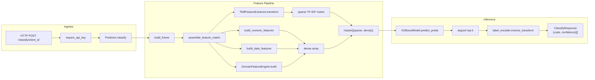
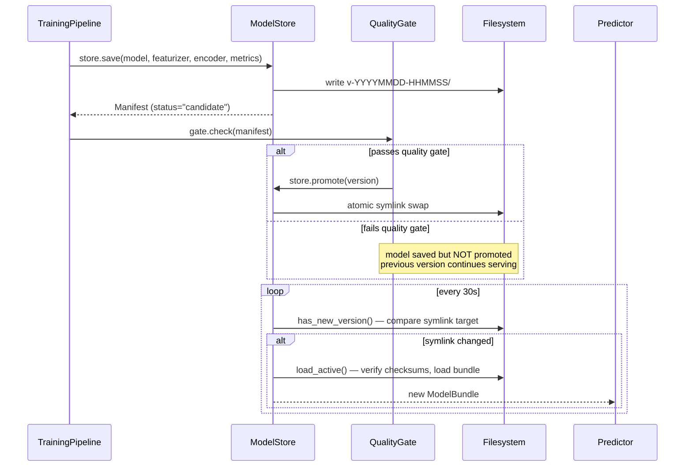
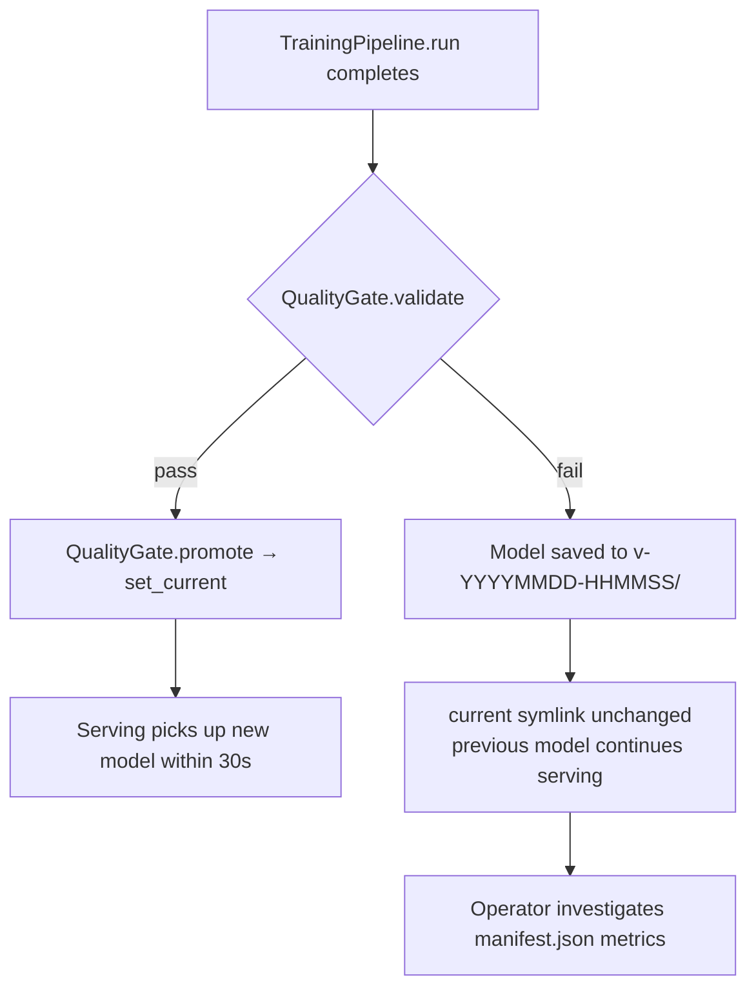

# Design Document

Technical deep-dive into the transaction-classifier architecture. For setup and usage, see [README.md](README.md).

---

## 1. Data Flow: Raw Transaction to Prediction

A bank transaction enters the system as a JSON payload on the `/classify/{client_id}` endpoint and exits as a ranked list of account code predictions with confidence scores.



### Concrete path through the code

1. **`inference/routes/classify.py`** -- FastAPI route receives `ClassifyRequest`, enforces batch size limit (`batch_limit=100`), resolves the `Predictor` for the given `client_id`.
2. **`inference/predictor.py :: Predictor.classify`** -- Converts `list[TransactionPayload]` to a DataFrame via `build_frame`, calls `assemble_feature_matrix(df, text_extractor, domain_engine, fit=False)`.
3. **`core/features/pipeline.py :: assemble_feature_matrix`** -- Orchestrator. Builds dense features from four families (numeric, date, domain via `DomainFeatureEngine`), builds sparse TF-IDF features via `TfidfFeatureExtractor.transform`, concatenates with `scipy.sparse.hstack`.
4. **`core/models/xgboost_model.py :: XGBoostModel.predict_proba`** -- Converts the sparse matrix to `xgb.DMatrix`, calls `booster.predict` to get class probabilities.
5. **`inference/predictor.py`** -- Takes the probability matrix, `argsort`s for top-k, inverse-transforms indices through `LabelEncoder` to recover account code strings.

---

## 2. Feature Pipeline Architecture

The feature pipeline concatenates **sparse** (TF-IDF) and **dense** (domain/numeric/date) representations into a single sparse matrix. This is the core design choice: XGBoost's `hist` tree method handles sparse data natively, so we avoid densifying the TF-IDF matrix (which can be 10,000+ columns) and keep memory usage proportional to non-zero entries.

### Feature families

| Family | Module | Output type | Typical dimensions |
|--------|--------|-------------|-------------------|
| Text (TF-IDF) | `core/features/text.py` | `scipy.sparse.spmatrix` | up to 10,000 |
| Numeric | `core/features/standard.py` | `pd.DataFrame` (dense) | 8 |
| Date | `core/features/standard.py` | `pd.DataFrame` (dense) | 13 |
| Domain | `core/features/engine.py` | `pd.DataFrame` (dense) | ~60–80 (profile-driven) |

### Text features: 3 TF-IDF vectorizers

`TfidfFeatureExtractor` (`core/features/text.py`) runs three independent `TfidfVectorizer` instances:

| Vectorizer | Input | Analyzer | n-gram range | max_features |
|------------|-------|----------|--------------|--------------|
| `vec_label` | `description` | `word` | (1, 2) | 4,000 |
| `vec_detail` | `remarks` (HTML-cleaned) | `word` | (1, 2) | 4,000 |
| `vec_char` | `description + " " + remarks` | `char_wb` | (3, 5) | 1,000 |

All three use `sublinear_tf=True` (log-dampened term frequency), `min_df=3`, `max_df=0.95`. The char n-gram vectorizer operates on character boundaries (`char_wb`) to capture morphological patterns in French accounting text (e.g., "prlv", "vir sepa", "chq").

**Vocabulary sizing rationale:** A grid search over `(label, detail, char)` combinations (`scripts/tfidf_search.py`) on the 7.5K-row synthetic dataset found that effective vocabulary saturates below 1,000 features per vectorizer when `min_df=3`. Character n-grams showed the clearest signal: `char=1000` consistently outperformed both smaller (500) and larger (2000+) sizes. Word-level vectorizers (`label`, `detail`) showed no significant difference above 1,000 features. We set `max_features` to 4,000 for word vectorizers to accommodate larger, more diverse real-world datasets while keeping the feature space manageable. Full results: `results/tfidf_search_*.txt`.

The three sparse matrices are horizontally stacked:

```python
# text.py :: TfidfFeatureExtractor.transform
return hstack([X_description, X_remarks, X_char])
```

### Dense feature concatenation

All dense families are concatenated into a single NumPy array:

```python
# pipeline.py :: assemble_feature_matrix
X_dense = pd.concat(
    [X_numeric, X_date, X_domain], axis=1
).values
```

### Final concatenation

The sparse TF-IDF matrix and the dense array are joined via `scipy.sparse.hstack`. The dense array is implicitly converted to CSR format during the hstack call:

```python
# pipeline.py :: assemble_feature_matrix
return hstack([X_text, X_dense])
```

This produces a single sparse matrix that XGBoost consumes directly via `xgb.DMatrix`.

### Domain features in detail

`DomainFeatureEngine` (`core/features/engine.py`) encodes treasury-specific knowledge loaded from a YAML profile (`config/profiles/french_treasury.yaml`). The profile is selected via the `TXCLS_FEATURE_PROFILE` environment variable. All patterns and thresholds are defined in the profile — no domain logic is hardcoded in Python.

- **Entity patterns** -- regex-based binary features for each entity defined in the profile (e.g., `tax_authority`, `social_contributions`, `telecom`). Applied to both `remarks` and `description`.
- **Amount signals** -- magnitude buckets (micro/small/medium/large/major), round-number indicators, named salary/wage range detection. Thresholds are read from the profile's `amount_signals` section.
- **Fiscal period indicators** -- quarter boundaries, VAT filing windows, corporate tax windows, URSSAF contribution windows. Dates come from the profile's `fiscal_indicators` section.
- **Text structural patterns** -- regex detectors for references, invoice markers, date patterns, and payment channels (virement, prelevement, carte, cheque). Defined in the profile's `text_signals` section.
- **Structured SEPA fields** -- parses SEPA reference fields (CPY, RUM, IBE, REF, RCN, NBE, NPY, LCC, LC2, PDO) from `remarks` and detects transaction mode (direct_debit, transfer, card_payment, etc.). Field patterns are in the profile's `structured_fields` section.

To adapt the system for a different domain or country, create a new YAML profile following the same schema.

### Public-Knowledge Constants

All domain-specific constants live in `config/profiles/french_treasury.yaml`, which is the single source of truth for the feature profile. The values come from public sources:

#### Fiscal Calendar

The fiscal-period features use dates from the French tax calendar, which is public information:

- **TVA (VAT) filing:** quarterly on months 1, 4, 7, 10 ([impots.gouv.fr](https://www.impots.gouv.fr))
- **IS (corporate tax) instalments:** quarterly on months 3, 6, 9, 12 (four acomptes per year)
- **URSSAF social contributions:** due between the 5th and 15th of the following month (size-dependent)
- **SMIC (minimum wage):** published annually by the French government (~€1,400 net monthly in 2026)

These are not proprietary knowledge --- any French accounting ML system would encode the same calendar. They are defined in the `fiscal_indicators` and `amount_signals.named_ranges` sections of the profile.

#### SEPA Field Codes

The SEPA structured-comment fields (CPY, RUM, IBE, REF, RCN, NBE, NPY, LCC, LC2, PDO) are defined in the SEPA Credit Transfer and Direct Debit specifications (EPC standards). Parsing these fields is standard practice for any European banking data pipeline. Field patterns are defined in the `structured_fields.field_patterns` section of the profile.

---

## 3. Model Artifact Lifecycle



### Versioned directory layout

```
models/{client_id}/
  v-20260301-120000/
    classifier.json        # XGBoost model (JSON format)
    text_features.joblib   # {label, detail, char} TfidfVectorizers
    label_encoder.joblib   # sklearn LabelEncoder
    manifest.json          # Manifest (version, metrics, checksums, status)
  v-20260315-093000/
    ...
  current -> v-20260315-093000   (symlink)
```

### Artifact checksums

`ModelStore.save` computes SHA-256 for every artifact file and stores them in `manifest.json` under `checksums`. On load, `ModelStore._verify_checksums` re-hashes each file and raises `RuntimeError` on mismatch. This guards against partial writes and corrupted artifacts.

### Atomic symlink promotion

`ModelStore.promote` performs an atomic swap to avoid serving a half-updated symlink:

```python
# core/artifacts/store.py :: ModelStore.promote
tmp = self.root / f".current_swap_{os.getpid()}"
if tmp.exists() or tmp.is_symlink():
    tmp.unlink()
tmp.symlink_to(target.resolve())
tmp.rename(link)  # atomic on POSIX
```

The `rename` is atomic on POSIX filesystems -- there is no window where `current` points to nothing.

### Hot-reload

The background watcher in `inference/app.py :: lifespan` polls every `reload_poll_secs` (default 30s):

```python
# inference/app.py :: watch_for_updates
async def watch_for_updates():
    interval = settings.reload_poll_secs
    while True:
        await asyncio.sleep(interval)
        for client_id, store in list(stores.items()):
            if store.has_new_version():
                bundle = store.load_active()
                app.state.predictors[client_id] = Predictor(bundle, ...)
```

`ModelStore.has_new_version` reads the symlink target and compares it to the last-loaded version string. The assignment to `app.state.predictors[client_id]` is a single dict reference swap -- in-flight requests on the old predictor complete normally.

---

## 4. Multi-Client Isolation

Each client is a separate accounting entity with its own transaction history, account chart, and model.

### Registry

`core/data/registry.py :: ClientRegistry` loads `clients.yaml`:

```yaml
clients:
  - id: acme_corp
    database_url: postgresql://...
    query: "SELECT ... FROM transactions LIMIT %(limit)s"
  - id: globex
    database_url: postgresql://...
    query: "SELECT ... FROM globex_transactions LIMIT %(limit)s"
```

Each `ClientConfig` holds: `id`, `database_url`, and a `query` string. The provider executes the query directly, substituting `%(limit)s` with the configured row limit.

### Isolation boundaries

| Concern | Isolation mechanism |
|---------|-------------------|
| Data | Postgres schema per client (`schema` field in `ClientConfig`) |
| Models | Separate directory tree: `models/{client_id}/current -> v-...` |
| Training | Independent `TrainingPipeline` runs per client |
| Serving | Separate `Predictor` and `ModelStore` instances in `app.state.predictors[client_id]` |
| API routing | Path parameter: `POST /classify/{client_id}` |

### What is shared

- The codebase itself -- all clients use the same `TrainingPipeline`, `assemble_feature_matrix`, `XGBoostModel`.
- The feature pipeline structure (same vectorizer configs, same domain feature profile). Per-client feature vocabulary is captured in the serialized `text_features.joblib`.
- The `PostgresProvider` implementation — each client supplies its own SQL query string.

### Lifecycle during serving

At startup, `lifespan` iterates `registry.clients`, creates one `ModelStore` per client, and loads each client's `current` model bundle. Clients without a trained model log a warning and return 503 on prediction requests. The background watcher polls all clients independently.

---

## 5. Quality Gate

`training/validator.py :: QualityGate` implements a post-training quality gate that decides whether a newly trained model is promoted to `current`.

### Baseline-Relative Lift

Rather than fixed thresholds, the quality gate adapts to each dataset:

```python
class QualityGate:
    def __init__(self, min_lift: float = 0.20):
        ...

    def check(self, manifest, baseline_accuracy, n_classes):
        acc_threshold = baseline_accuracy * (1 + self.min_lift)
        bal_threshold = (1.0 / n_classes) * (1 + self.min_lift)
```

The gate requires the model to beat the majority-class baseline by at least 20% (configurable via `TXCLS_MIN_LIFT`). This adapts automatically to dataset difficulty and class count --- a 10-class dataset has a different random-chance baseline than a 200-class one.

### Failure behavior



The failed model's artifacts remain on disk (status `"candidate"` in `Manifest`), so an operator can inspect metrics, compare against the current model, and manually promote if appropriate via `ModelStore.promote`.

---

## 6. Security Model

### API key tiers

| Tier | Header | Config key | Protects |
|------|--------|-----------|----------|
| Prediction | `X-API-Key` | `TXCLS_API_KEYS` (comma-separated) | `POST /classify/{client_id}` |
| Admin | `X-API-Key` | `TXCLS_ADMIN_API_KEYS` (comma-separated) | `POST /ops/refresh`, `POST /ops/confidence-histogram/{client_id}` |

### Implementation

`inference/auth.py` defines two FastAPI dependencies: `require_api_key` and `require_admin_key`.

The `/health` endpoint returns `{"status": "healthy"}` when at least one model is loaded, and `{"status": "degraded"}` otherwise.

Key comparison uses `hmac.compare_digest` to prevent timing side-channel attacks:

```python
# inference/auth.py :: _matches_any
def _matches_any(provided: str, valid_keys: list[str]) -> bool:
    encoded = provided.encode()
    return any(
        hmac.compare_digest(encoded, key.encode())
        for key in valid_keys
    )
```

Note: the `any()` short-circuits on the first match, so an attacker can infer how many keys exist by timing. This is acceptable for a private API with a small key list. For a public-facing API, use a single hashed key with constant-time lookup.

### Dev mode bypass

When the key list is empty (the default), auth is disabled entirely:

```python
# inference/auth.py :: require_api_key
if not settings.api_keys:
    return  # no keys configured → skip auth
```

This lets developers run the API locally without configuring keys. In production, set `TXCLS_API_KEYS` and `TXCLS_ADMIN_API_KEYS`.

### SQL schema injection

`source.py` uses Python `.format()` to inject schema names into SQL. These values come from `clients.yaml`, which is operator-controlled configuration — not user input. Parameterized schema identifiers are not supported by `psycopg2`, so this is an accepted tradeoff for this use case.

---

## 7. Explainability

The `/explain/{client_id}` endpoint uses SHAP `TreeExplainer` to decompose each prediction into per-feature contributions. For a given transaction, it answers: "which features pushed the model toward this accounting code, and by how much?"

SHAP is an optional dependency (`explain` extra). The endpoint lazy-imports it and returns HTTP 501 if unavailable, keeping the core serving image lightweight. `TreeExplainer` is created per-request rather than cached — explanation workloads are lower-volume than classification, and caching a `TreeExplainer` across model reloads would require invalidation logic that isn't warranted.

Feature names are resolved by `collect_feature_names()` in `core/features/pipeline.py`, which maps each column index to a human-readable name (e.g., `desc_urssaf`, `ent_social_contributions`, `fiscal_urssaf_window`). This function derives names by calling `TfidfFeatureExtractor.feature_names` and `DomainFeatureEngine.feature_names`, ensuring the name order matches the matrix column order produced by `assemble_feature_matrix`.

---

## 8. Hyperparameter Defaults Rationale

All defaults are defined in `core/config.py :: Settings` and in `core/models/xgboost_model.py :: XGBoostModel.__init__`.

### Tree ensemble

| Parameter | Value | Rationale |
|-----------|-------|-----------|
| `n_estimators` | 500 | Budget for boosting rounds. Not expected to complete -- early stopping should kick in well before 500. |
| `patience` | 40 | Patience of 40 rounds on the validation set's `mlogloss`. Tighter than the previous 50-round default; sufficient to survive temporary plateaus while stopping sooner on flat loss curves. |
| `max_depth` | 6 | Deeper than the XGBoost default (3). The feature space is dense (entity flags, amount buckets, TF-IDF tokens), and interactions between text features and amount patterns matter (e.g., "URSSAF" + salary range = specific account code). Depth 6 captures these interactions without exploding tree complexity. |
| `learning_rate` | 0.05 | Moderate shrinkage. With early stopping, a lower rate builds a more robust ensemble at the cost of more iterations. 0.05 balances convergence speed and ensemble quality for typical dataset sizes. |

### Regularization

| Parameter | Value | Rationale |
|-----------|-------|-----------|
| `reg_alpha` (L1) | 1.0 | Encourages sparsity in leaf weights. Important when TF-IDF features create thousands of weak signals -- L1 pushes irrelevant features toward zero contribution. |
| `reg_lambda` (L2) | 5.0 | Aggressive ridge penalty. Prevents any single tree from overfitting rare classes with few samples. Higher than typical defaults (1.0) because class imbalance is severe in accounting data. |
| `min_child_weight` | 10 | Minimum sum of instance weight in a child node. Prevents splits on tiny subsets, which is common when rare account codes have <50 samples. |
| `gamma` | 0.5 | Minimum loss reduction for a split. Acts as a pruning threshold -- splits that don't improve loss by at least 0.5 are rejected. |
| `max_delta_step` | 1 | Bounds the weight update per tree. Stabilizes training on imbalanced multi-class problems where a few dominant classes can drive large gradient updates. |

### Stochastic boosting

| Parameter | Value | Rationale |
|-----------|-------|-----------|
| `subsample` | 0.7 | Row sampling per tree. Standard stochastic gradient boosting -- 30% dropout reduces overfitting and decorrelates trees. |
| `colsample_bytree` | 0.7 | Column sampling per tree. With 10,000+ features, ensures each tree sees a different feature subset. |
| `colsample_bylevel` | 0.7 | Column sampling per depth level. Additional diversity within each tree -- particularly effective when feature families (text vs. numeric vs. domain) have very different scales. |

### Feature extraction

| Parameter | Value | Rationale |
|-----------|-------|-----------|
| `tfidf_max_label` | 4,000 | `description` is a short label (5-30 words). 4K features provide headroom for larger vocabularies on real-world data (grid search showed saturation below 1K on synthetic data). |
| `tfidf_max_detail` | 4,000 | `remarks` can contain SEPA details and HTML. Set equal to label --- grid search found no benefit from asymmetric sizing. |
| `tfidf_max_char` | 1,000 | Character n-grams (3-5) on the combined text. Grid search identified 1K as optimal --- captures morphological patterns and handles misspellings/abbreviations that word-level tokenization misses. |

### Data split

| Parameter | Value | Rationale |
|-----------|-------|-----------|
| `train_ratio` | 0.80 | Temporal split -- the earliest 80% of transactions train, the latest 20% validate. This simulates production conditions where the model must predict future transactions from past patterns. A larger validation window provides a more robust accuracy estimate. |
| `min_class_samples` | 10 | Classes with fewer than 10 samples are dropped during data loading. Below this threshold, the model cannot learn a meaningful pattern and the class would destabilize balanced accuracy. |

### Feature ablation

Accuracy on the temporal validation split (15% most recent transactions) with cumulative feature sets. Each row adds one feature family to the previous row. All models use the same XGBoost hyperparameters (500 estimators, depth 6, lr 0.05).

| Feature set | Accuracy | Balanced Accuracy |
|---|---|---|
| TF-IDF only | 0.5679 | 0.4444 |
| + numeric features | 0.6140 | 0.5084 |
| + date features | 0.6043 | 0.5090 |
| + domain features (all) | 0.6025 | 0.5087 |

> **Note on synthetic data:** Date and domain features show marginal or negative lift here because the synthetic generator produces uniformly distributed timestamps and simplified entity patterns. On real client data, where fiscal-period clustering and entity-specific accounting rules create learnable signals, domain features contributed +3-5% top-1 accuracy. The features are retained because the system is designed for production data characteristics, not synthetic benchmarks.
